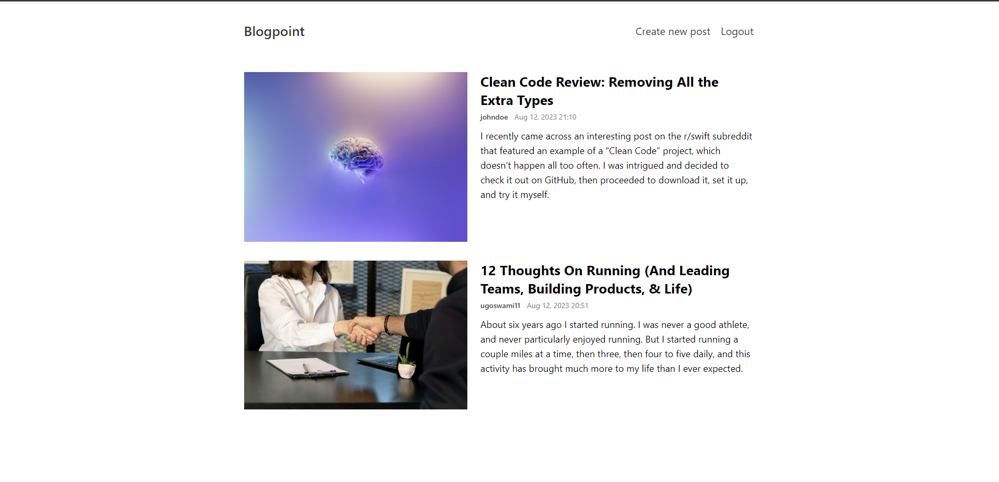
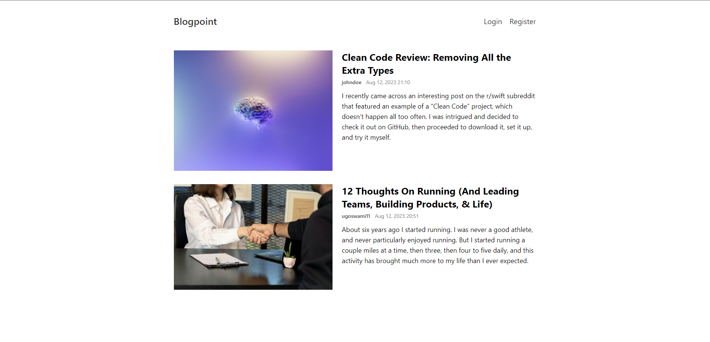
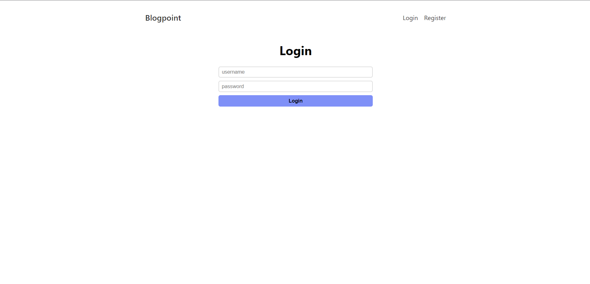
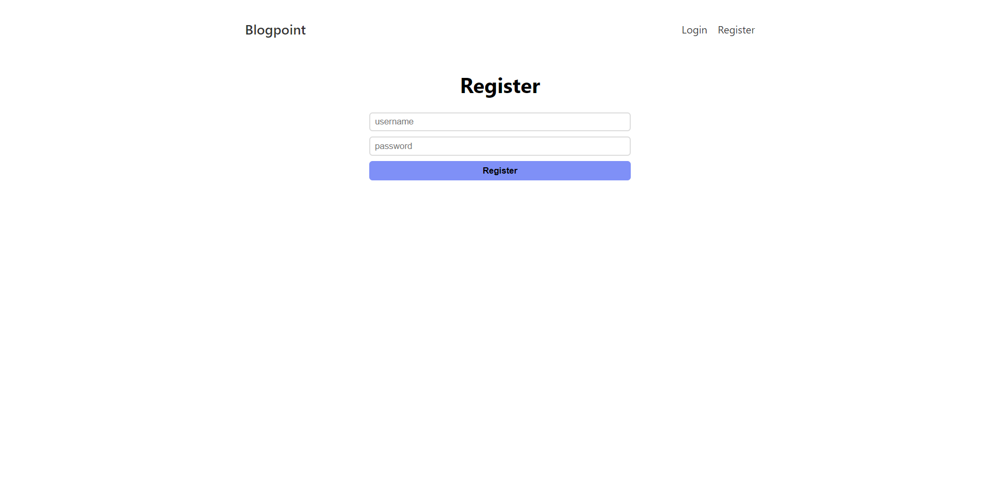
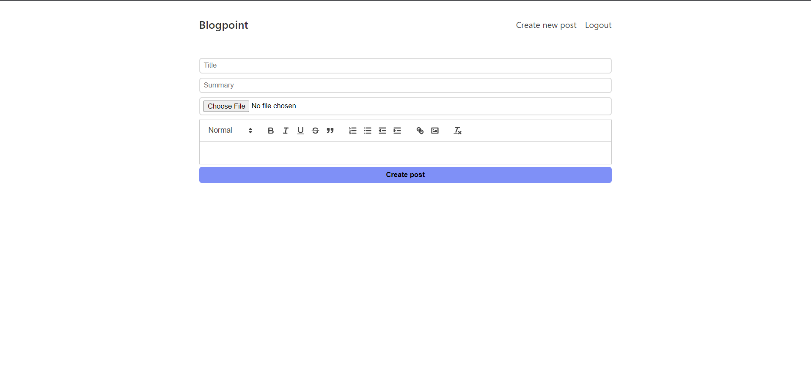
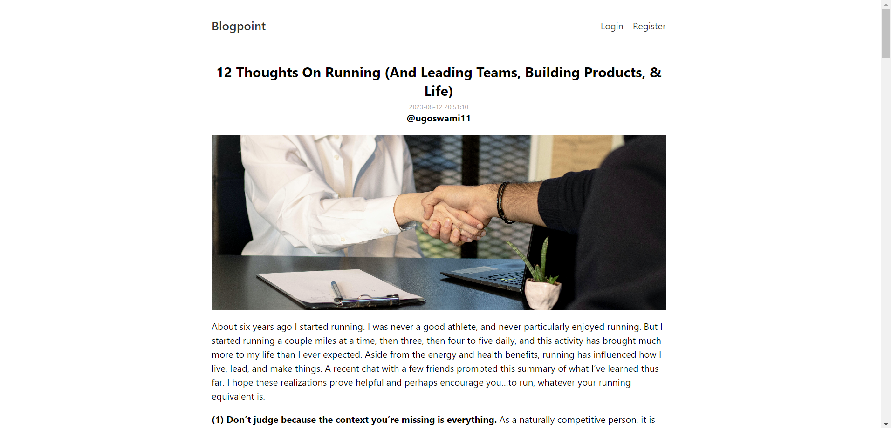
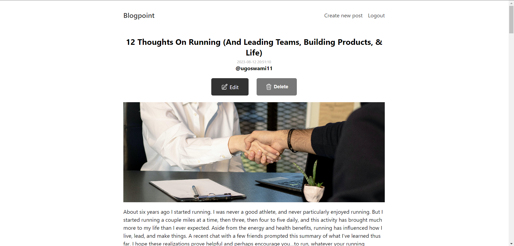
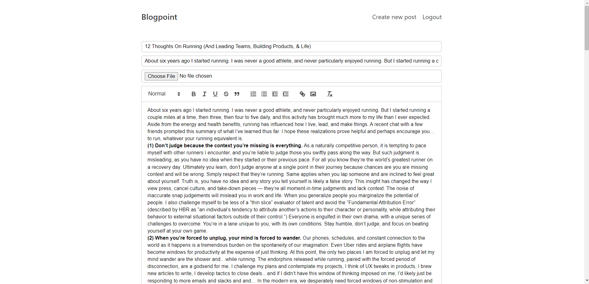

# Blog App
This project is about a simple blog app where user can Register or Login to the app and create their posts with images and different styling offered by the Editor. User can also view blogs posted by other users and can edit or delete their own blog posts.

### Features of this App
- Login and Register functionality
- Create, Delete and Update blog posts
- Upload Images for posts from device
- Responsive web design

### Preview

### Developer with

*Frontend*
- React
- react-dom
- react-router-dom

*Backend*
- Express
- bcrypt
- cookie parser
- Mongo DB
- cors
- multer
- jsonwebtoken
- mongoose